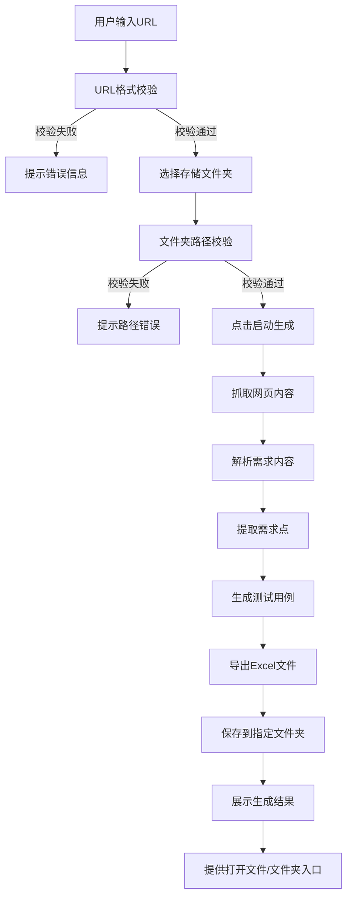

## 1. 产品概述

测试用例自动生成工具，通过输入需求文档URL地址，自动抓取页面内容并分析需求，智能生成标准化测试用例并导出为Excel文件，存储到用户指定的本地文件夹。

- 主要用途：帮助测试人员快速将需求文档转化为可执行的测试用例，大幅提升测试效率
- 解决问题：手动编写测试用例耗时耗力、格式不统一、容易遗漏需求点
- 目标用户：测试工程师、QA人员、产品经理

## 2. 核心功能

### 2.1 用户角色

| 角色 | 注册方式 | 核心权限 |
|------|----------|----------|
| 普通用户 | 无需注册，本地工具 | 配置URL、指定文件夹、生成测试用例、查看生成结果 |

### 2.2 功能模块

1. **首页控制台**：URL输入模块、文件夹选择模块、生成控制模块、进度展示模块、历史记录模块
2. **需求解析引擎**：网页内容抓取、需求智能识别、需求结构化处理
3. **用例生成引擎**：需求转用例规则匹配、用例标准化生成、边界值自动补充
4. **Excel导出模块**：用例格式化、多Sheet支持、文件保存

### 2.3 页面详情

| 页面名称 | 模块名称 | 功能描述 |
|---------|---------|----------|
| 首页控制台 | URL输入模块 | 支持HTTP/HTTPS协议URL输入、URL格式校验、历史URL下拉选择 |
| 首页控制台 | 文件夹选择模块 | 本地文件夹浏览器、路径校验、自动创建不存在的目录 |
| 首页控制台 | 生成控制模块 | 启动/停止按钮、生成参数配置（用例模板、覆盖规则） |
| 首页控制台 | 进度展示模块 | 实时进度条、当前处理步骤、日志输出、预计剩余时间 |
| 首页控制台 | 结果展示模块 | 生成用例数量统计、用例预览表格、打开文件/文件夹快捷按钮 |
| 首页控制台 | 历史记录模块 | 最近生成记录列表、一键重新生成、历史文件快速访问 |

## 3. 核心流程

用户在控制台输入需求文档URL，选择本地存储文件夹，点击启动按钮后，系统自动抓取网页内容，解析并提取需求点，基于测试用例模板生成标准化测试用例，最后导出为Excel文件保存到指定目录。

## 4. 用户界面设计

### 4.1 设计风格

- **主色调**：深邃科技蓝 (#0F172A) 作为背景色，搭配明亮的青蓝色 (#0EA5E9) 作为主强调色
- **辅助色**：成功绿 (#10B981)、警告橙 (#F59E0B)、错误红 (#EF4444)
- **按钮风格**：圆角矩形按钮，带有微妙的渐变和悬浮动效，主按钮使用发光效果
- **字体**：标题使用现代无衬线字体 'Space Grotesk'，正文使用 'Inter' 保证可读性
- **布局风格**：卡片式模块化布局，左侧为配置区，右侧为结果和日志区，采用不对称栅格创造视觉张力
- **视觉元素**：磨砂玻璃质感卡片、微妙的网格背景、渐变边框、发光效果、流畅的过渡动画

### 4.2 页面设计概述

| 页面名称 | 模块名称 | UI元素 |
|---------|---------|--------|
| 首页控制台 | 顶部导航 | 渐变Logo、工具标题、版本号、主题切换按钮 |
| 首页控制台 | URL输入模块 | 带图标的输入框、下拉历史记录、校验状态图标、粘贴按钮 |
| 首页控制台 | 文件夹选择模块 | 路径输入框、浏览按钮、文件夹图标、路径存在状态指示 |
| 首页控制台 | 生成控制区 | 大型启动按钮（带脉冲动画）、停止按钮、高级配置折叠面板 |
| 首页控制台 | 进度展示区 | 分段进度条、步骤指示器、实时日志面板（带自动滚动） |
| 首页控制台 | 结果展示区 | 统计卡片网格、用例预览表格、快捷操作按钮组 |
| 首页控制台 | 历史记录区 | 时间线式列表、悬停高亮、操作按钮组 |

### 4.3 响应式设计

- **桌面端优先**：采用12列栅格系统，主内容区最小宽度1200px
- **平板适配**：双栏布局改为上下堆叠，主按钮尺寸保持不变
- **移动适配**：单栏流式布局，输入框全宽显示，表格支持横向滚动
- **触控优化**：按钮最小尺寸48x48px，增加触控反馈效果

### 4.4 交互细节

- 页面加载：元素错落有致地滑入，背景渐变缓慢流动
- 输入聚焦：边框发光、轻微上浮效果
- 按钮悬浮：微妙的缩放和阴影加深，主按钮增加光晕扩散
- 生成过程：进度条平滑增长，日志逐行淡入，状态指示点呼吸闪烁
- 完成动画：结果卡片从底部滑入，统计数字滚动计数，礼花效果庆祝完成
- 空状态：友好的插画占位，引导用户开始第一次生成
