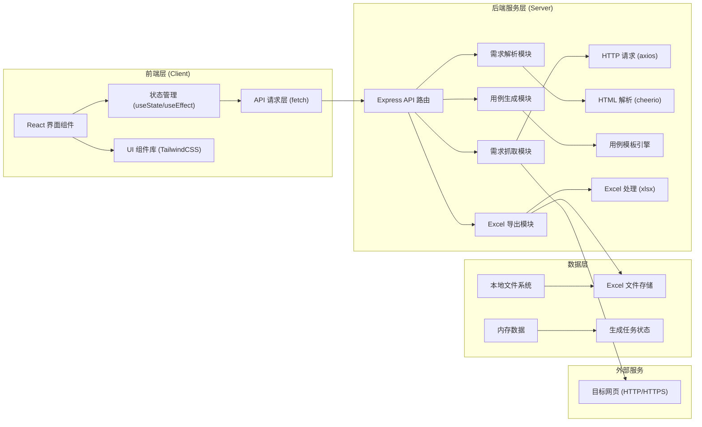
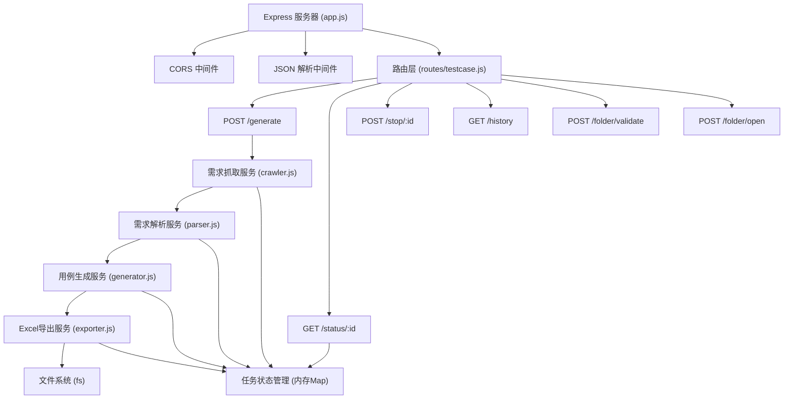
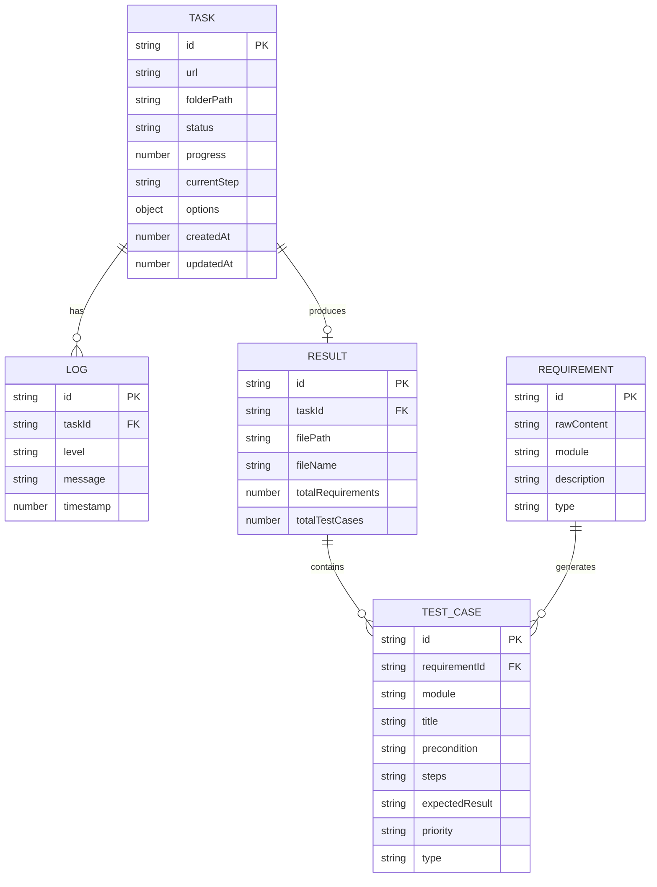

## 1. 架构设计



## 2. 技术描述

* **前端**：React\@18 + TailwindCSS\@3 + Vite\@5

* **后端**：Express\@4 + Node.js\@18+

* **包管理器**：npm

* **代码规范**：ESLint + Prettier

* **版本控制**：Git（可选）

### 核心依赖库

| 库名称          | 版本           | 用途          |
| ------------ | ------------ | ----------- |
| express      | ^4.19.2      | 后端Web框架     |
| cors         | ^2.8.5       | 跨域资源共享      |
| axios        | ^1.7.2       | HTTP请求库     |
| cheerio      | ^1.0.0-rc.12 | HTML内容解析    |
| xlsx         | ^0.18.5      | Excel文件处理   |
| uuid         | ^9.0.1       | 任务ID生成      |
| react        | ^18.3.1      | 前端框架        |
| react-dom    | ^18.3.1      | React DOM渲染 |
| lucide-react | ^0.395.0     | 图标库         |

## 3. 目录结构

```
Automate-dtest-cases/
├── .trae/documents/          # 项目文档
├── client/                    # 前端项目
│   ├── src/
│   │   ├── components/       # React组件
│   │   │   ├── UrlInput.jsx
│   │   │   ├── FolderSelector.jsx
│   │   │   ├── ControlPanel.jsx
│   │   │   ├── ProgressPanel.jsx
│   │   │   ├── ResultPanel.jsx
│   │   │   └── HistoryList.jsx
│   │   ├── App.jsx           # 主应用组件
│   │   ├── main.jsx          # 入口文件
│   │   ├── api.js            # API请求封装
│   │   └── index.css         # 全局样式
│   ├── index.html
│   ├── package.json
│   ├── vite.config.js
│   └── tailwind.config.js
├── server/                    # 后端项目
│   ├── src/
│   │   ├── routes/           # API路由
│   │   │   └── testcase.js
│   │   ├── services/         # 业务逻辑
│   │   │   ├── crawler.js    # 网页抓取服务
│   │   │   ├── parser.js     # 需求解析服务
│   │   │   ├── generator.js  # 用例生成服务
│   │   │   └── exporter.js   # Excel导出服务
│   │   ├── utils/            # 工具函数
│   │   │   ├── validator.js  # 校验工具
│   │   │   └── logger.js     # 日志工具
│   │   └── app.js            # 应用入口
│   ├── package.json
│   └── .env.example
└── README.md                 # 项目说明（用户如需要则创建）
```

## 4. 路由定义

### 前端路由

| 路由 | 页面    | 说明            |
| -- | ----- | ------------- |
| /  | 首页控制台 | 唯一页面，包含所有功能模块 |

### 后端API路由

| 方法   | 路由                           | 用途         |
| ---- | ---------------------------- | ---------- |
| GET  | /api/health                  | 健康检查       |
| POST | /api/testcase/generate       | 启动测试用例生成任务 |
| GET  | /api/testcase/status/:taskId | 查询任务状态     |
| POST | /api/testcase/stop/:taskId   | 停止生成任务     |
| GET  | /api/testcase/history        | 获取历史生成记录   |
| POST | /api/folder/validate         | 验证文件夹路径    |
| POST | /api/folder/open             | 打开指定文件夹    |

## 5. API 定义

### 类型定义

```typescript
// 生成任务请求
interface GenerateRequest {
  url: string;
  folderPath: string;
  options?: {
    template?: 'standard' | 'detailed' | 'simple';
    includeBoundary?: boolean;
    fileName?: string;
  };
}

// 生成任务响应
interface GenerateResponse {
  taskId: string;
  status: 'pending' | 'running' | 'completed' | 'failed';
  message: string;
}

// 任务状态响应
interface TaskStatusResponse {
  taskId: string;
  status: 'pending' | 'running' | 'completed' | 'failed';
  progress: number;
  currentStep: string;
  logs: LogEntry[];
  result?: GenerateResult;
  error?: string;
}

// 日志条目
interface LogEntry {
  timestamp: number;
  level: 'info' | 'warn' | 'error';
  message: string;
}

// 生成结果
interface GenerateResult {
  totalRequirements: number;
  totalTestCases: number;
  filePath: string;
  fileName: string;
  testCases: TestCase[];
}

// 测试用例
interface TestCase {
  id: string;
  requirementId: string;
  requirement: string;
  module: string;
  title: string;
  precondition: string;
  steps: string[];
  expectedResult: string;
  priority: 'high' | 'medium' | 'low';
  type: 'functional' | 'interface' | 'performance' | 'security';
}

// 历史记录
interface HistoryRecord {
  id: string;
  url: string;
  folderPath: string;
  fileName: string;
  totalTestCases: number;
  createdAt: number;
  status: 'completed' | 'failed';
}
```

## 6. 服务器架构



## 7. 数据模型

### 7.1 核心数据模型



### 7.2 内存存储说明

由于本工具为本地单机应用，不使用数据库，所有数据存储在内存中：

* `taskMap`: `Map<string, Task>` - 存储所有任务状态

* `historyList`: `HistoryRecord[]` - 存储历史生成记录（可持久化到本地JSON文件）

### 7.3 Excel 输出格式

| 列名   | 说明                                | 示例             |
| ---- | --------------------------------- | -------------- |
| 用例ID | 自动生成的唯一标识                         | TC-0001        |
| 所属模块 | 需求所属模块                            | 用户登录           |
| 用例标题 | 测试用例简要描述                          | 验证正确用户名密码登录成功  |
| 前置条件 | 执行用例前的条件                          | 系统正常运行，用户账号已注册 |
| 测试步骤 | 1. 打开登录页面2. 输入用户名3. 输入密码4. 点击登录按钮 | 分步操作说明         |
| 预期结果 | 期望的执行结果                           | 登录成功，跳转到首页     |
| 优先级  | High/Medium/Low                   | High           |
| 用例类型 | 功能/界面/性能/安全                       | 功能             |
| 关联需求 | 对应的原始需求                           | 用户登录功能         |

## 8. 核心技术实现要点

### 8.1 网页抓取模块

* 使用 axios 发送 HTTP GET 请求

* 配置 User-Agent 避免被拦截

* 处理编码问题（UTF-8、GBK 等）

* 超时设置和错误重试机制

### 8.2 需求解析模块

* 使用 cheerio 解析 HTML DOM

* 识别常见需求结构：标题、列表、段落

* 基于关键词识别需求类型（功能、界面、性能等）

* 智能提取需求点，过滤无关内容

### 8.3 用例生成模块

* 基于模板的用例生成规则

* 正向用例和反向用例自动生成

* 边界值用例补充

* 优先级自动判定

### 8.4 Excel 导出模块

* 使用 xlsx 库生成 Excel 文件

* 多 Sheet 支持：测试用例、需求清单、统计信息

* 单元格样式设置（表头、边框、颜色）

* 自动列宽调整

