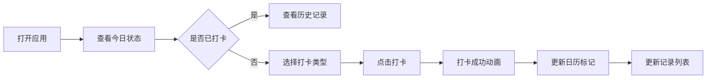

## 1. 产品概述

便捷打卡助手是一款移动端H5应用，为用户提供简单易用的日常打卡功能，帮助用户养成良好习惯、记录学习工作进度。

- **核心目的**：提供轻量化的打卡工具，支持用户快速记录每日活动
- **目标用户**：学生、职场人士、习惯养成爱好者
- **产品价值**：无需下载安装，随时随地记录，简洁高效的打卡体验

## 2. 核心功能

### 2.1 用户角色

| 角色 | 注册方式 | 核心权限 |
|------|----------|----------|
| 普通用户 | 无需注册（本地存储） | 打卡、查看记录、编辑打卡类型 |

### 2.2 功能模块

1. **打卡主页**：今日打卡状态、快速打卡按钮、连续打卡天数
2. **日期选择**：日历视图、历史日期打卡记录查看
3. **打卡记录**：打卡列表展示、打卡统计信息
4. **打卡类型**：支持自定义打卡类型（学习、工作、运动等）

### 2.3 页面详情

| 页面名称 | 模块名称 | 功能描述 |
|----------|----------|----------|
| 打卡主页 | 今日状态卡片 | 显示今日日期、已打卡/未打卡状态、连续打卡天数 |
| 打卡主页 | 快速打卡区 | 打卡类型选择、打卡按钮、打卡成功动画反馈 |
| 打卡主页 | 日历视图 | 月份切换、日期高亮显示已打卡日期 |
| 打卡记录页 | 记录列表 | 按时间倒序展示打卡记录，显示打卡类型和时间 |
| 打卡记录页 | 统计信息 | 本月打卡天数、总打卡次数、最长连续打卡 |
| 打卡设置页 | 类型管理 | 添加、编辑、删除自定义打卡类型 |

## 3. 核心流程

用户打开应用 → 查看今日打卡状态 → 选择打卡类型 → 点击打卡按钮 → 显示打卡成功反馈 → 自动更新日历和记录列表

## 4. 用户界面设计

### 4.1 设计风格

- **主色调**：清新绿色 (#10B981) - 象征成长、坚持、积极向上
- **辅助色**：橙色 (#F59E0B) - 用于强调按钮和重要状态
- **背景色**：浅米色 (#F8F5F0) - 温暖舒适的视觉感受
- **按钮风格**：圆润大按钮，带微妙阴影，点击有按压效果
- **字体**：使用系统无衬线字体，移动端优化字号
- **布局风格**：卡片式布局，圆角设计，充足留白
- **图标风格**：简约线性图标，使用emoji增强视觉趣味性

### 4.2 页面设计概述

| 页面名称 | 模块名称 | UI元素 |
|----------|----------|--------|
| 打卡主页 | 状态卡片 | 大字号日期、醒目打卡状态标识、连续打卡徽章 |
| 打卡主页 | 打卡区 | 类型标签横向滚动、大尺寸打卡按钮、成功动效 |
| 打卡主页 | 日历视图 | 网格布局、已打卡日期圆点标记、今日高亮 |
| 打卡记录页 | 记录列表 | 时间轴样式、打卡类型图标、时间戳 |
| 打卡设置页 | 类型管理 | 可编辑卡片、颜色选择器、添加按钮 |

### 4.3 响应式

- 采用移动端优先设计，针对375px宽度优化
- 支持横竖屏自适应布局
- 触控区域不小于48x48px，适合手指操作
- 底部导航固定，方便单手操作

### 4.4 微交互动效

- 打卡按钮点击时有缩放和弹跳动画
- 打卡成功显示彩色礼花效果
- 日历切换有平滑滑动过渡
- 列表项入场时有淡入动画
