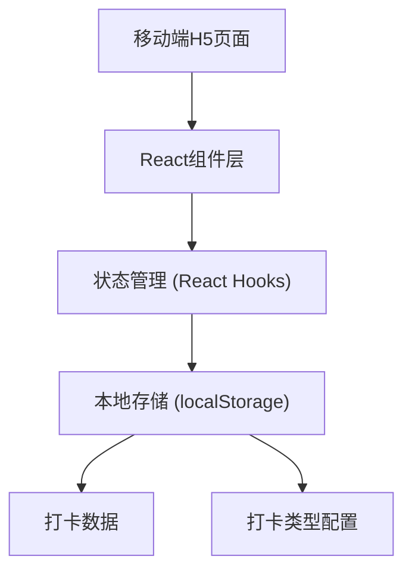
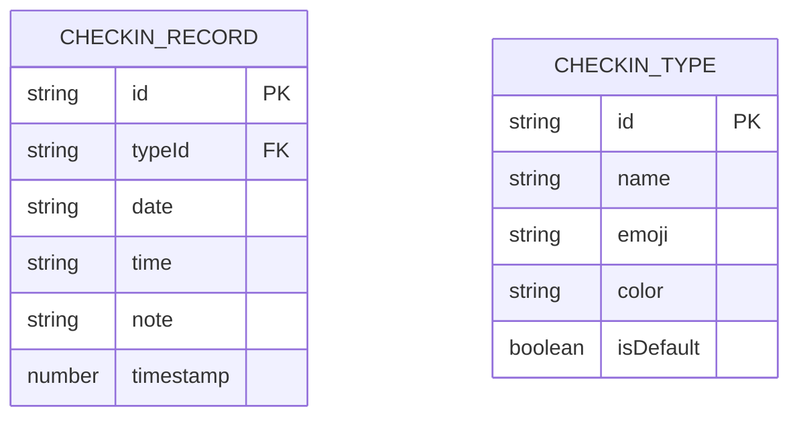

## 1. 架构设计



## 2. 技术描述

- **前端框架**：React@18 + TypeScript
- **构建工具**：Vite@5
- **样式方案**：TailwindCSS@3 + PostCSS
- **路由管理**：React Router@6
- **数据存储**：localStorage（纯前端本地存储，无需后端）
- **动画库**：CSS原生动画 + framer-motion（可选）

## 3. 路由定义

| 路由 | 页面 | 功能描述 |
|------|------|----------|
| / | 打卡主页 | 今日打卡、日历视图、快速打卡 |
| /records | 打卡记录 | 历史记录列表、统计数据 |
| /settings | 打卡设置 | 打卡类型管理 |

## 4. 数据模型

### 4.1 数据模型定义



### 4.2 TypeScript 类型定义

```typescript
// 打卡类型
interface CheckinType {
  id: string;
  name: string;
  emoji: string;
  color: string;
  isDefault: boolean;
}

// 打卡记录
interface CheckinRecord {
  id: string;
  typeId: string;
  date: string; // YYYY-MM-DD
  time: string; // HH:mm
  note?: string;
  timestamp: number;
}

// 应用状态
interface AppState {
  checkinTypes: CheckinType[];
  checkinRecords: CheckinRecord[];
  selectedDate: string;
  selectedTypeId: string;
}
```

### 4.3 存储结构

localStorage 存储键名：
- `easycheck_types`: 打卡类型配置
- `easycheck_records`: 打卡记录列表

## 5. 核心组件结构

```
src/
├── components/
│   ├── Header/           # 页面头部
│   ├── BottomNav/        # 底部导航
│   ├── StatusCard/       # 今日状态卡片
│   ├── CheckinButton/    # 打卡按钮
│   ├── TypeSelector/     # 打卡类型选择器
│   ├── Calendar/         # 日历组件
│   ├── RecordList/       # 记录列表
│   ├── StatsCard/        # 统计卡片
│   └── TypeManager/      # 类型管理
├── pages/
│   ├── Home.tsx          # 打卡主页
│   ├── Records.tsx       # 记录页面
│   └── Settings.tsx      # 设置页面
├── hooks/
│   ├── useCheckin.ts     # 打卡逻辑hook
│   └── useLocalStorage.ts# 本地存储hook
├── utils/
│   ├── date.ts           # 日期工具函数
│   └── storage.ts        # 存储工具函数
├── types/
│   └── index.ts          # 类型定义
└── data/
    └── defaultTypes.ts   # 默认打卡类型
```

## 6. 默认打卡类型数据

```typescript
const defaultCheckinTypes: CheckinType[] = [
  { id: '1', name: '学习', emoji: '📚', color: '#10B981', isDefault: true },
  { id: '2', name: '工作', emoji: '💼', color: '#3B82F6', isDefault: true },
  { id: '3', name: '运动', emoji: '🏃', color: '#F59E0B', isDefault: true },
  { id: '4', name: '阅读', emoji: '📖', color: '#8B5CF6', isDefault: true },
  { id: '5', name: '早起', emoji: '🌅', color: '#EC4899', isDefault: true },
];
```
