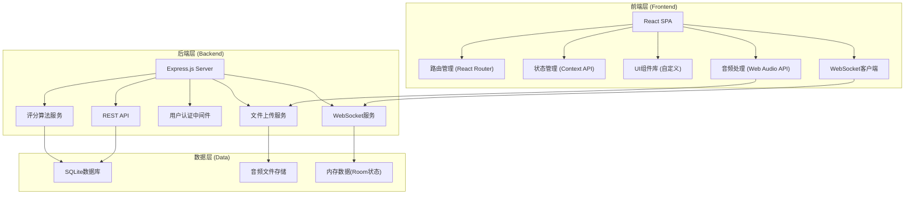
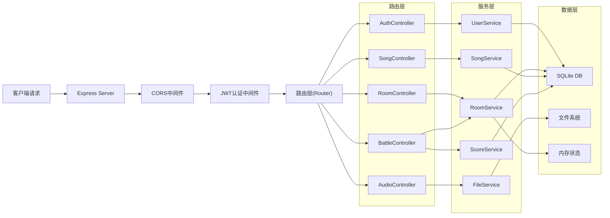
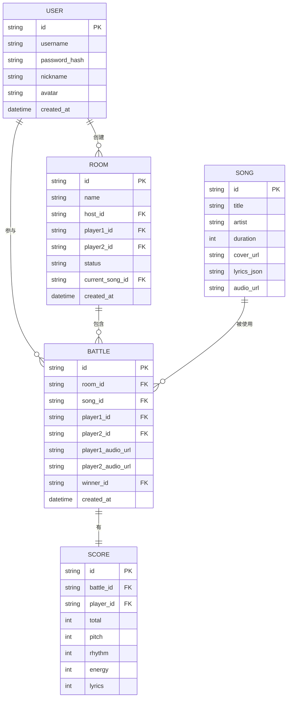

## 1. 架构设计



## 2. 技术栈描述

- **前端**: React@18 + Vite@5 + React Router@6
- **样式**: TailwindCSS@3 + 自定义CSS动画
- **状态管理**: React Context API + useReducer
- **音频处理**: Web Audio API + MediaRecorder API
- **实时通信**: Socket.io
- **后端**: Express@4 + Node.js
- **数据库**: SQLite (sqlite3)
- **文件存储**: 本地文件系统
- **认证**: JWT (jsonwebtoken)
- **密码加密**: bcryptjs

## 3. 路由定义

### 前端路由

| 路由 | 页面组件 | 功能 |
|------|----------|------|
| /login | LoginPage | 登录注册页面 |
| /lobby | LobbyPage | 歌房大厅 |
| /room/:roomId | RoomPage | 歌房房间页 |
| /songs | SongsPage | 歌曲库页面 |
| /result/:battleId | ResultPage | 评分结果页 |
| /profile | ProfilePage | 个人中心 |

### 后端API路由

| 方法 | 路由 | 功能 |
|------|------|------|
| POST | /api/auth/register | 用户注册 |
| POST | /api/auth/login | 用户登录 |
| GET | /api/user/profile | 获取用户信息 |
| GET | /api/rooms | 获取房间列表 |
| POST | /api/rooms | 创建房间 |
| GET | /api/rooms/:id | 获取房间详情 |
| POST | /api/rooms/:id/join | 加入房间 |
| POST | /api/rooms/:id/invite | 邀请好友 |
| GET | /api/songs | 获取歌曲列表 |
| GET | /api/songs/:id | 获取歌曲详情(含歌词) |
| POST | /api/battles/start | 开始对战 |
| POST | /api/battles/score | 提交评分 |
| GET | /api/battles/:id | 获取对战结果 |
| POST | /api/audio/upload | 上传音频 |
| GET | /api/audio/:id | 获取音频文件 |

## 4. API类型定义

```typescript
// 用户类型
interface User {
  id: string;
  username: string;
  nickname: string;
  avatar: string;
  createdAt: string;
}

// 房间类型
interface Room {
  id: string;
  name: string;
  hostId: string;
  hostName: string;
  player1: User | null;
  player2: User | null;
  status: 'waiting' | 'ready' | 'playing' | 'finished';
  currentSong: Song | null;
  createdAt: string;
}

// 歌曲类型
interface Song {
  id: string;
  title: string;
  artist: string;
  duration: number;
  cover: string;
  lyrics: LyricLine[];
  audioUrl: string;
}

interface LyricLine {
  time: number;
  text: string;
  pitch: number;
}

// 对战类型
interface Battle {
  id: string;
  roomId: string;
  songId: string;
  player1Id: string;
  player2Id: string;
  player1Score: ScoreDetail;
  player2Score: ScoreDetail;
  winnerId: string | null;
  audio1Url: string;
  audio2Url: string;
  createdAt: string;
}

interface ScoreDetail {
  total: number;
  pitch: number;
  rhythm: number;
  energy: number;
  lyrics: number;
}
```

## 5. 服务器架构



## 6. 数据模型

### 6.1 ER图



### 6.2 DDL语句

```sql
-- 用户表
CREATE TABLE users (
  id TEXT PRIMARY KEY,
  username TEXT UNIQUE NOT NULL,
  password_hash TEXT NOT NULL,
  nickname TEXT NOT NULL,
  avatar TEXT DEFAULT '',
  created_at DATETIME DEFAULT CURRENT_TIMESTAMP
);

-- 房间表
CREATE TABLE rooms (
  id TEXT PRIMARY KEY,
  name TEXT NOT NULL,
  host_id TEXT NOT NULL,
  player1_id TEXT,
  player2_id TEXT,
  status TEXT DEFAULT 'waiting',
  current_song_id TEXT,
  created_at DATETIME DEFAULT CURRENT_TIMESTAMP,
  FOREIGN KEY (host_id) REFERENCES users(id),
  FOREIGN KEY (player1_id) REFERENCES users(id),
  FOREIGN KEY (player2_id) REFERENCES users(id)
);

-- 歌曲表
CREATE TABLE songs (
  id TEXT PRIMARY KEY,
  title TEXT NOT NULL,
  artist TEXT NOT NULL,
  duration INTEGER NOT NULL,
  cover_url TEXT,
  lyrics_json TEXT NOT NULL,
  audio_url TEXT
);

-- 对战表
CREATE TABLE battles (
  id TEXT PRIMARY KEY,
  room_id TEXT NOT NULL,
  song_id TEXT NOT NULL,
  player1_id TEXT NOT NULL,
  player2_id TEXT NOT NULL,
  player1_audio_url TEXT,
  player2_audio_url TEXT,
  winner_id TEXT,
  created_at DATETIME DEFAULT CURRENT_TIMESTAMP,
  FOREIGN KEY (room_id) REFERENCES rooms(id),
  FOREIGN KEY (song_id) REFERENCES songs(id)
);

-- 评分表
CREATE TABLE scores (
  id TEXT PRIMARY KEY,
  battle_id TEXT NOT NULL,
  player_id TEXT NOT NULL,
  total INTEGER NOT NULL,
  pitch INTEGER NOT NULL,
  rhythm INTEGER NOT NULL,
  energy INTEGER NOT NULL,
  lyrics INTEGER NOT NULL,
  FOREIGN KEY (battle_id) REFERENCES battles(id),
  FOREIGN KEY (player_id) REFERENCES users(id)
);

-- 插入示例歌曲数据
INSERT INTO songs (id, title, artist, duration, cover_url, lyrics_json, audio_url) VALUES
('song1', '小幸运', '田馥甄', 240, '/covers/xiaoxingyun.jpg', '[{"time":0,"text":"我听见雨滴落在青青草地","pitch":60},...]', '/audios/xiaoxingyun.mp3'),
('song2', '告白气球', '周杰伦', 215, '/covers/gaobaiqiqiu.jpg', '[{"time":0,"text":"塞纳河畔左岸的咖啡","pitch":55},...]', '/audios/gaobaiqiqiu.mp3'),
('song3', '稻香', '周杰伦', 223, '/covers/daoxiang.jpg', '[{"time":0,"text":"对这个世界如果你有太多的抱怨","pitch":50},...]', '/audios/daoxiang.mp3'),
('song4', '晴天', '周杰伦', 269, '/covers/qingtian.jpg', '[{"time":0,"text":"故事的小黄花","pitch":58},...]', '/audios/qingtian.mp3'),
('song5', '光年之外', '邓紫棋', 235, '/covers/guangnianzhiwai.jpg', '[{"time":0,"text":"感受停在我发端的指尖","pitch":62},...]', '/audios/guangnianzhiwai.mp3');
```

## 7. 评分算法说明

### 评分维度

1. **音准(Pitch)**: 40% - 检测用户演唱音高与标准音高的偏差
2. **节奏(Rhythm)**: 30% - 检测用户演唱时机与歌词时间戳的匹配度
3. **能量(Energy)**: 15% - 检测音量大小和情感表达
4. **歌词完整性(Lyrics)**: 15% - 检测歌词演唱的完整度

### 实现方式

- 使用Web Audio API的AnalyserNode获取音频频率数据
- 前端进行实时音高检测(RMS + 自相关算法)
- 将检测数据发送到后端进行综合评分计算
- 使用归一化算法将各维度得分转换为0-100分
