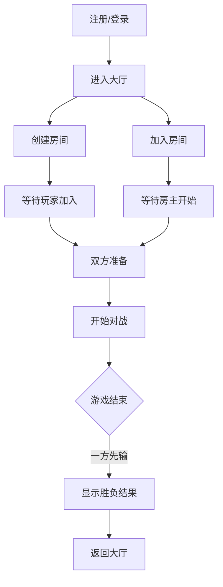

## 1. 产品概述
俄罗斯方块对战系统是一款在线双人对战游戏，用户可以注册登录后创建或加入房间，与另一玩家实时对战。先消除行数达到目标或对方先游戏结束（堆满）的一方获胜。
- 主要目的：提供一个在线实时对战的俄罗斯方块游戏平台
- 目标用户：喜欢休闲对战游戏的玩家

## 2. 核心功能

### 2.1 用户角色
| 角色 | 注册方式 | 核心权限 |
|------|---------|---------|
| 普通用户 | 用户名密码注册 | 创建房间、加入房间、对战游戏 |

### 2.2 功能模块
1. **登录注册页**：用户注册、用户登录
2. **大厅页**：房间列表、创建房间、加入房间、用户信息
3. **房间页**：等待玩家、准备游戏、开始对战
4. **游戏页**：俄罗斯方块游戏、对战信息、聊天（可选）

### 2.3 页面详情
| 页面名称 | 模块名称 | 功能描述 |
|---------|---------|---------|
| 登录注册页 | 登录模块 | 输入用户名密码，登录系统 |
| 登录注册页 | 注册模块 | 输入用户名密码，注册新账号 |
| 大厅页 | 房间列表 | 显示所有可加入的房间 |
| 大厅页 | 创建房间 | 创建新的对战房间 |
| 大厅页 | 用户信息 | 显示当前登录用户信息，退出登录 |
| 房间页 | 等待模块 | 显示房间内玩家，等待另一玩家加入 |
| 房间页 | 准备模块 | 玩家准备，双方准备后开始游戏 |
| 游戏页 | 游戏面板 | 显示自己的游戏区域、方块下落、消行 |
| 游戏页 | 对手面板 | 显示对手的游戏区域 |
| 游戏页 | 对战信息 | 显示双方得分、消行数、游戏状态 |

## 3. 核心流程
用户注册 → 用户登录 → 进入大厅 → 创建房间/加入房间 → 等待另一玩家 → 双方准备 → 开始对战 → 一方游戏结束 → 判定胜负 → 返回大厅

## 4. 用户界面设计

### 4.1 设计风格
- **主色调**：深色赛博朋克风格，以深蓝、紫色为主色调，霓虹绿色作为强调色
- **按钮风格**：发光边框、圆角、悬停时亮度增强
- **字体**：使用像素风格或等宽字体，营造复古游戏氛围
- **布局风格**：卡片式布局，玻璃拟态效果，深色背景配合发光元素
- **图标风格**：简洁的线条图标，发光效果

### 4.2 页面设计概述
| 页面名称 | 模块名称 | UI元素 |
|---------|---------|--------|
| 登录注册页 | 表单模块 | 发光输入框、霓虹按钮、背景网格动画 |
| 大厅页 | 房间列表 | 卡片式房间展示、悬停发光效果、滚动动画 |
| 房间页 | 等待界面 | 玩家头像、准备状态指示器、倒计时动画 |
| 游戏页 | 游戏面板 | 像素风格方块、发光边框、下落动画、消行特效 |

### 4.3 响应式
- Desktop-first设计，优先保证桌面端游戏体验
- 适配1080p及以上分辨率
- 游戏区域使用固定像素比例保证游戏体验

### 4.4 视觉动效
- 页面切换使用淡入淡出过渡
- 按钮悬停有发光扩散效果
- 方块下落有平滑动画
- 消行时有闪光和粒子效果
- 游戏结束时有庆祝/失败动画
