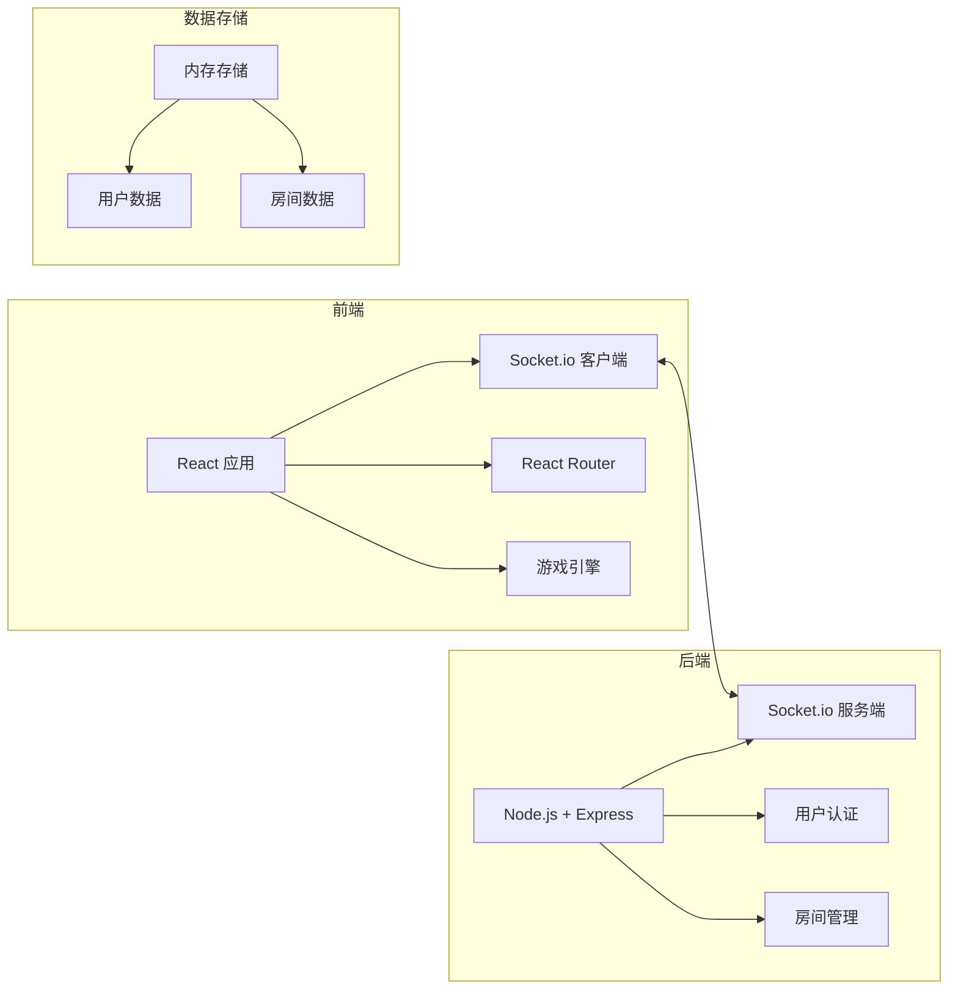
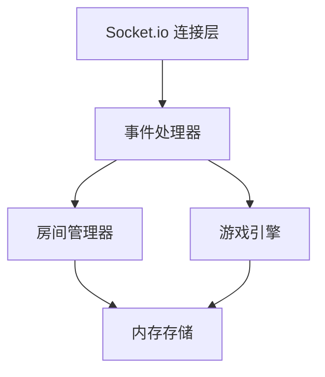
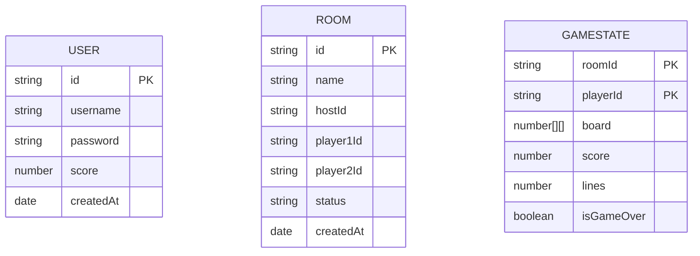

## 1. 架构设计


## 2. 技术描述
- **前端**：React@18 + TypeScript + Vite + tailwindcss@3 + Socket.io-client
- **后端**：Node.js + Express@4 + Socket.io
- **实时通信**：Socket.io 用于实时游戏同步和房间管理
- **数据存储**：开发阶段使用内存存储，生产可扩展到Redis/数据库
- **构建工具**：Vite

## 3. 路由定义
| 路由 | 用途 |
|------|------|
| / | 登录注册页面 |
| /lobby | 游戏大厅 |
| /room/:roomId | 房间等待页面 |
| /game/:roomId | 游戏对战页面 |

## 4. API 定义

### 4.1 HTTP API
```typescript
// 用户注册
POST /api/register
Request: { username: string, password: string }
Response: { success: boolean, token: string, user: User }

// 用户登录
POST /api/login
Request: { username: string, password: string }
Response: { success: boolean, token: string, user: User }

// 获取房间列表
GET /api/rooms
Response: { rooms: Room[] }
```

### 4.2 Socket.io 事件
```typescript
// 客户端 → 服务端
'join-lobby' { userId: string }
'create-room' { userId: string, roomName: string }
'join-room' { userId: string, roomId: string }
'leave-room' { userId: string, roomId: string }
'ready-game' { userId: string, roomId: string }
'start-game' { roomId: string }
'game-move' { roomId: string, userId: string, data: GameState }
'game-over' { roomId: string, userId: string, score: number }
'send-garbage' { roomId: string, fromUserId: string, lines: number }

// 服务端 → 客户端
'room-created' { room: Room }
'room-updated' { room: Room }
'player-joined' { user: User }
'player-left' { userId: string }
'game-started' { players: User[] }
'game-state-update' { userId: string, state: GameState }
'game-ended' { winnerId: string, reason: string }
'receive-garbage' { lines: number }
```

## 5. 服务端架构


## 6. 数据模型

### 6.1 数据模型定义


### 6.2 TypeScript 类型定义
```typescript
interface User {
  id: string;
  username: string;
  score: number;
}

interface Room {
  id: string;
  name: string;
  hostId: string;
  player1?: User;
  player2?: User;
  status: 'waiting' | 'ready' | 'playing' | 'finished';
  player1Ready?: boolean;
  player2Ready?: boolean;
}

interface Piece {
  shape: number[][];
  color: string;
  x: number;
  y: number;
}

interface GameState {
  board: number[][];
  currentPiece: Piece;
  nextPiece: Piece;
  score: number;
  lines: number;
  level: number;
  isGameOver: boolean;
}
```
